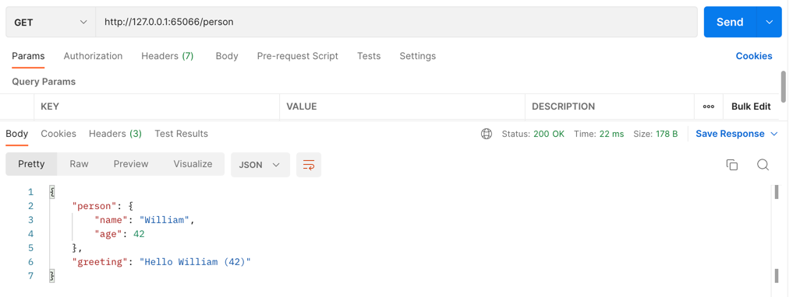

# Microservice
## Devops
* The developed service image is created. In my example I created this image by dockerfile. 
```bash
docker image build -t example-task .
```
* This image is tagged/versioned and pushed to an image hub. I used docker hub.
```bash
docker tag example-task:v1.0.0 thiyya/example-task:latest
docker push thiyya/example-task:latest
```
* https://hub.docker.com/repository/docker/thiyya/example-task
* A system such as k8s or docker swarm is used for 
automating deployment, scaling and management of containerized applications of this image. I used k8s.
* Minikube provides us a single node k8s cluster in our locale.
```bash
minikube start
```
* A yml file is created for the deployment. In this yml, there are many definitions such as the name of the service, 
number of replicas, access, network, from which image it will be generated, how it will be exposed. 
* You can see the deployment.yaml I created for this example.
```bash
kubectl apply -f deployment.yaml
```
* I created the greetings service on Minikube and made it ready for use.
```bash
kubectl get pods -o=wide
```

```bash
NAME                               READY   STATUS    RESTARTS   AGE     IP           NODE       NOMINATED NODE   READINESS GATES
firstdeployment-7d5b676748-lqdjn   1/1     Running   0          4m36s   172.17.0.3   minikube   <none>           <none>
```

* I created a service.yaml to create network to the greeting service. You can see the service.yaml I created for this example 
```bash
kubectl get service
```
```bash
NAME         TYPE        CLUSTER-IP      EXTERNAL-IP   PORT(S)          AGE
backend      NodePort    10.96.148.165   <none>        8080:32250/TCP   9s
```
* Minikube provides a service to open a tunnel to nodeport. To do this : 
```bash
minikube service --url backend
```
```bash
http://127.0.0.1:65066
❗  Because you are using a Docker driver on darwin, the terminal needs to be open to run it.
```
* Now you can use this url to access the greeting service 
